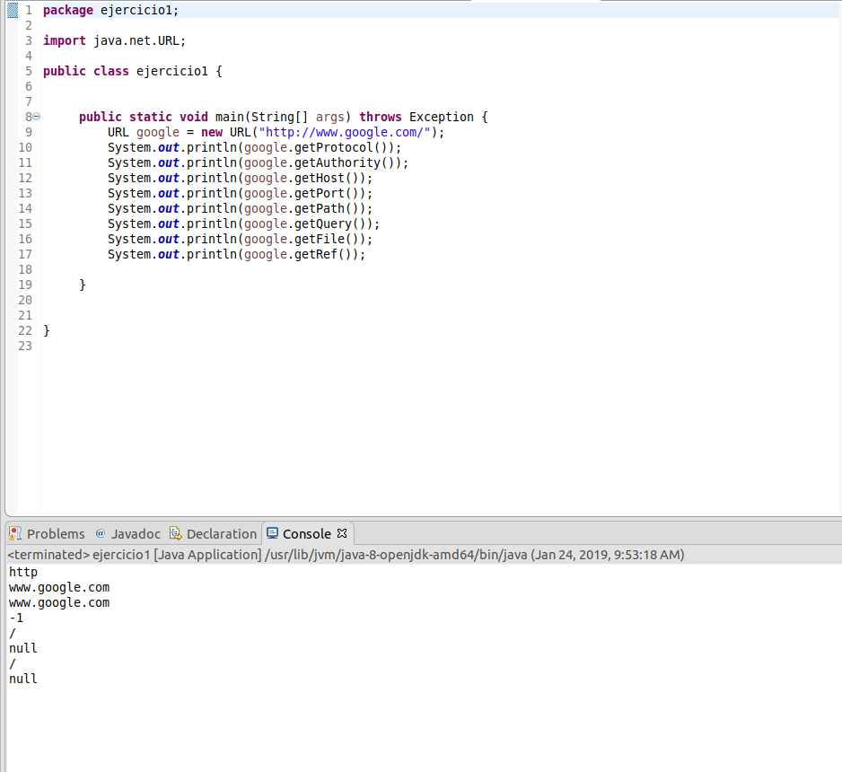
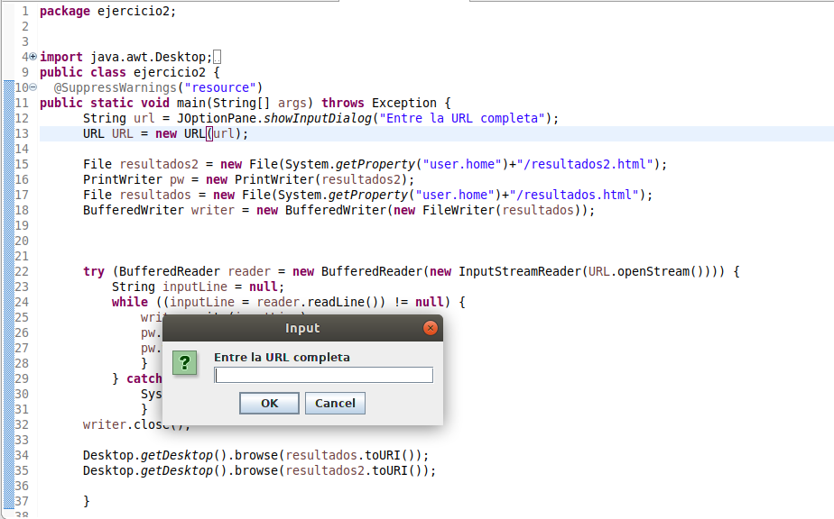
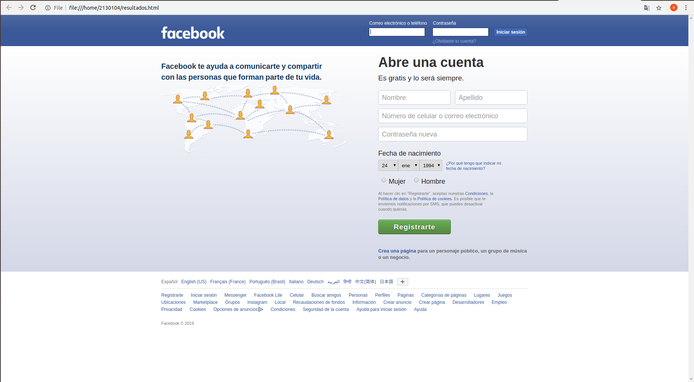

# Networking

## Reconocimiento

Parte de los contenidos y códigos de este taller están basados en los contenidos de los tutoriales de Java que se encuentran en: [https://docs.oracle.com/javase/tutorial/networking/index.html](https://docs.oracle.com/javase/tutorial/networking/index.html)

## 2.Conceptos básicos de redes

Los programas que se comunican a través de internet utilizan generalmente dos protocolos: el Transmission Control Protocol (TCP) o el User Datagram Protocol (UDP). En java en general usted utiliza clases ya implementadas en el paquete java.net.

##  2.1 TCP

El Transmission Control Protocol (TCP) es un protocolo basado en conexión que provee una conexión confiable entre dos computadores. TCP en particular mantiene el orden de los paquetes de datos y garantiza que todos los datos se entreguen

##  2.2. UDP

El User Datagram Protocol (UDP) es un protocolo que envía los datos en paquetes llamados datagramas, no provee garantía de entrega ni de orden de entrega. Este protocolo no esta basado en conexión

## 2.3. Que son los puertos

En general los computadores tiene una sola conexión a Internet y todos los datos que llegan y salen utilizan esta conexión física. Sin embargo, el computador puede tener múltiples aplicativos que utilizan la red. Para separar la información que es enviada a una aplicativo específico se asigno un número lógico a cada aplicación. Este número es denominado el puerto y , como veremos más adelante, es utilizado para enviar datos a aplicaciones específicas en computadores remotos. Los protocolos de TCP y UDP utilizan estos puertos para enviar los datos que llegan a las aplicaciones correctas. Recuerde que cada aplicación que espera datos de la red se le asigna un puerto para que puede escuchar los datos que llegan a un puerto determinado. Los puertos se representan con un entero de 16 bits y tienen un rango de 0 hasta 65.535. Los puertos de 0- 1023 están restringidos para aplicaciones específicas por ejemplo el 80 es para el servidor web.

##  2.4. Clases que soportan el trabajo con redes en Java

Algunas de las clases que utilizan TCP en Java son: URL, URLConnection, Socket y ServerSocket. Todas están en el paquete java.net. Algunas de las clases que utilizan UDP en Java son:DatagramPacket, DatagramSocket y MulticastSocket . Todas están en el paquete java.net.

##  3.Trabajando con URLs

URL es la abreviación de Uniform Resource Locator, y es básicamente una dirección para localizar recursos en internet. Una idea clara de como son las URLs la encontramos en nuestro navegador de internet. Así, la forma general de una URL es la siguiente:

	<protocolo>://<servidor>:<puerto>/<dirección del recurso en el servidor>

un ejemplo concreto es:

	[http://ldbn.escuelaing.edu.co:80/index.html](http://ldbn.escuelaing.edu.co:80/index.html)

En java se puede crear un URL de varias maneras:

	URL personalSite = new URL("[http://ldbn.escuelaing.edu.co:80/](http://ldbn.escuelaing.edu.co:80/)");

Este código crea un objeto de tipo URL que lo asigna a la variable personalSite. También puede crear una URL relativa a otra de la siguiente manera: URL misPublicaciones = new URL(personalSite, "publications_bib.html");

Todos los constructores de la URL lanzan excepciones MalformedURLException, por lo que es necesario colocarlos dentro de un bloque try-catch

	try 

	{

	 URL myURL =  new  URL(.  .  .)

	 }  catch  (MalformedURLException e)

	 {

	 e.printStackTrace();

	 }
  
   

	 import java.io.*;

	 import java.net.*;

	 public  class  URLReader  {

	 public  static  void  main(String[] args)  throws Exception {

	 URL google =  new  URL("http://www.google.com/");

	 try  (BufferedReader reader =  new  BufferedReader(new  InputStreamReader(google.openStream())))  {

	 String inputLine = null;

	 while  ((inputLine = reader.readLine())  != null)  {

	 System.out.println(inputLine);

	 }

	 }  catch  (IOException x)  {

	 System.err.println(x);

	 }

	 }

	 }

Figura 1:clase que lee datos de internet

##  3.1. Leyendo los valores de un objeto URL

El programador puede usar varios métodos para leer la información de un objeto URL: getProtocol, getAuthority, getHost, getPort, getPath, getQuery, getFile, getRef

## EJERCICIO 1

Escriba un programa en el cual usted cree un objeto URL e imprima en pantalla cada uno de los datos que retornan los 8 métodos de la sección anterior.

##  3.2. Leyendo páginas de internet

Para leer páginas de internet debe crear flujos de datos (streams) y leer como si lo hiciera del teclado. El ejemplo siguiente lee datos de internet y los presenta en la pantalla (fig. 1).

#  EJERCICIO 2

Escriba una aplicación browser que pregunte una dirección URL al usuario y que lea datos de esa dirección y que los almacene en un archivo con el nombre resultado.html. Luego intente ver este archivo en el navegador.

# 

4.Sockets (enchufes)

Los sockets son los puntos finales del enlace de comunicación entre dos programas ejecutándose en la red. Cada socket esta vinculado a un puerto específico.

así la capa que implementa el protocolo TCP puede saber a que aplicación enviar los mensajes. En general un servidor es un proceso que se ejecuta y tiene un socket, vinculado a un puerto, que esta esperando solicitudes de clientes externos. Los sockets son una abstracción de más bajo nivel que las URLs y sirven para implementar protocolos de comunicación cliente-servidor. El protocolo cliente servidor consiste en un programa cliente que hace solicitudes a un programa servidor que atiende dichas solicitudes. Java provee dos clases para manejar la comunicación por medio de sockets: Socket y ServerSocket. Ambas clases se encuentran en el paquete java.net.

NOTA: Una idea clara para entender los sockets es imaginar que son los enchufes donde se conectan las aplicaciones para comunicarse.

## 4.1. Como usar los sockets desde el cliente

Vamos a utilizar sockets para crear un pequen˜o aplicativo cliente servidor. El aplicativo consiste en un cliente que envía mensajes y un servidor que responde con el mismo mensaje pero con una cadena “Respuesta:” al principio del mismo. El servidor también imprime en pantalla los mensajes que recibe. Antes de ver el código del cliente es importante ver que para obtener una conexión se usa el código:

miSocket =  new  Socket("127.0.0.1",  35000);

donde “127.0.0.1” es el host local y 35000 es el puerto. Estas sentencias tienen que estar rodeadas de bloque try-catch, para capturar los errores de conexi´on. Una vez tenga la conexi´on, puede obtener flujos (Streams) de entrada y salida utilizando

out =  new  PrintWriter(echoSocket.getOutputStream(),  true); in =  new  BufferedReader(new  InputStreamReader( echoSocket.getInputStream()));

Una vez tenga los streams, puede enviar solicitudes y recibir las respuestas. No olvide cerrar los sockets y los flujos. La figura 2 muestra el código del cliente

## 4.2. Como utilizar los sockets desde el servidor

La siguiente parte consiste en implementar el servidor. El servidor escucha en un puerto y responde a las solicitudes de cada cliente. La figura 3 tiene el código del servidor. Este servidor responde el mismo mensaje que recibe.

## 4.3 ejercicios

### 4.3.1

Escriba un servidor que reciba un número y responda el cuadrado de este número.

	import java.io.*;

	import java.net.*;

	public  class  EchoClient  {

	 public  static  void  main(String[] args)  throws IOException {

	 Socket echoSocket = null;

	 PrintWriter out = null;

	 BufferedReader in = null;

	 try  {

	 echoSocket =  new  Socket("127.0.0.1",  35000);

	 out =  new  PrintWriter(echoSocket.getOutputStream(),  true); in =  new  BufferedReader(new  InputStreamReader(echoSocket.getInputStream()));

	 }  catch  (UnknownHostException e)  {

	 System.err.println("Don’t know about host!.");

	 System.exit(1);

	 }  catch  (IOException e)  {

	 System.err.println("Couldn’t get I/O for "  +  "the connection to: localhost.");

	 System.exit(1);

	 }

	 BufferedReader stdIn =  new  BufferedReader(  new  InputStreamReader(System.in));

	 String userInput;

	 while  ((userInput = stdIn.readLine())  != null)  {

	 out.println(userInput);

	 System.out.println("echo: "  + in .readLine());

	 }

	 out.close(); in .close();

	 stdIn.close();

	 echoSocket.close();

	 }

>Figura 2: clase cliente que envía datos y recibe respuestas

	 import java.net.*;
		
	 import java.io.*;

	 public  class  EchoServer  {

	 public  static  void  main(String[] args)  throws IOException {

	 ServerSocket serverSocket = null;

	 try  {

	 serverSocket =  new  ServerSocket(35000);

	 }  catch  (IOException e)  {

	 System.err.println("Could not listen on port: 35000.");

	 System.exit(1);

	 }

	 Socket clientSocket = null;

	 try  {

	 clientSocket = serverSocket.accept();

	 }  catch  (IOException e)  {

	 System.err.println("Accept failed.");

	 System.exit(1);

	 }

	 PrintWriter out =  new  PrintWriter(clientSocket.getOutputStream(),  true);

	 BufferedReader in =  new  BufferedReader(new  InputStreamReader(clientSocket.getInputStream()));

	 String inputLine, outputLine;

	 while  ((inputLine = in .readLine())  != null)  {

	 System.out.println(‘‘Mensaje: ’’+inputLine);

	 outputLine = ‘‘Respuesta’’ + inputLine;

	 out.println(outputLine);

	 if  (outputLine.equals("Respuestas: Bye."))  break;

	 }

	 out.close(); in .close();

	 clientSocket.close();

	 serverSocket.close();

	 }

	 }

Figura 3: clase servidor que regresa el mismo mensaje que lee

### 4.3.2

Escriba un servidor que pueda recibir un número y responda con un operación sobre este número. Este servidor puede recibir un mensaje que empiece por “fun:”, si recibe este mensaje cambia la operación a las especificada. El servidor debe responder las funciones seno, coseno y tangente. Por defecto debe empezar calculando el coseno. Por ejemplo, si el primer número que recibe es 0, debe responder 1, si después recibe ⇡/2 debe responder 0, si luego recibe “fun:sin” debe cambiar la operación actual a seno, es decir a a partir de ese momento debe calcular senos. Si enseguida recibe 0 debe responder 0.

## 4.4. Servidor web

El código 4 presenta un servidor web que atiende una solicitud. Implemente el servidor e intente conectarse desde el browser.

## 4.5 Ejercicios

### 4.5.1

Escriba un servidor web que soporte múltiples solicitudes seguidas (no concurrentes). El servidor debe retornar todos los archivos solicitados, incluyendo páginas html e imágenes.

## 5.Datagramas

Los programas escritos en las secciones anteriores presentan ejemplos de aplicaciones que se conectan punto a punto con otras aplicaciones. Estos ejemplos usaban por debajo el protocolo TCP. Esta secci´on muestra programas que se comunican sin importar si los mensajes enviados fueron o no recibidos, o en que orden llegan. Esto, se implementa usando el protocolo UDP. La abstracci´on fundamental para hacer este tipo de programas es el datagrama y el java.net.DatagramSocket.

## 5.1. Datagramas

Un datagrama es un mensaje independiente autocontenido que es enviado a través de la red, y cuya llegada, tiempo de llegada y contenido no son garantizados. Estos datagramas son útiles para implementar servicios cuyos mensajes no tienen un contenido del cual dependen procesos fundamentales. Por ejemplo usted quiere que la comunicación entre un avión y la torre de control sea inmediata y garantizada, sin embargo, si tiene una página que muestra el estado del tiempo en la playa, no le importa si el último mensaje es de hace 1 hora y de pronto no es tan exacto.

